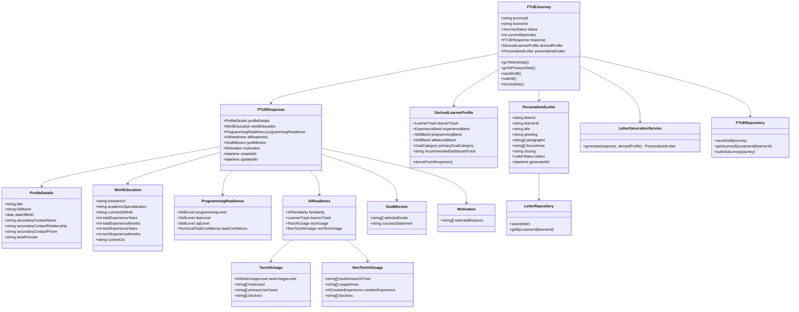
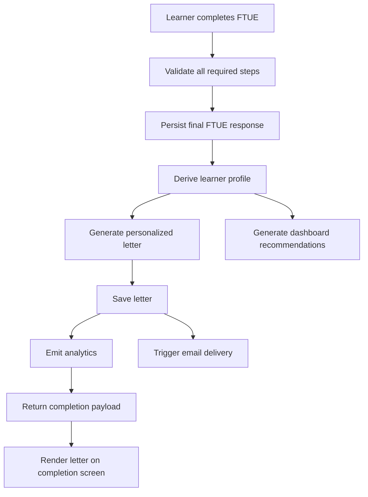

# FTUE Architecture

## Goal

Design the FTUE system from scratch so it is ready to implement as a standalone product surface.

This document defines:

- Recommended architecture direction
- Core domain model
- Class / data diagram
- Proposed frontend and backend file structure
- API boundaries
- Personalization generation flow

## Assumptions

These are the assumptions I am making so we can move fast:

- We will build this as a modern web app.
- The frontend will be implemented using `Next.js + TypeScript + React`.
- Form validation will use `zod`.
- Form state will use `react-hook-form`.
- The FTUE should support multi-step state, conditional branching, autosave readiness, and server-side persistence.
- Personalized letter generation should use a template-driven service, not fully raw generation.

If your eventual stack is different, the domain model and flow can still remain largely unchanged.

## High-Level System Design

The system should be split into 5 layers:

1. `Presentation layer`
   FTUE screens, step renderer, field components, progress UI, completion experience.

2. `Application layer`
   Step orchestration, branching logic, validation sequencing, submit orchestration, personalization trigger.

3. `Domain layer`
   Learner profile, readiness models, mission model, personalization rules, letter model.

4. `Data layer`
   Repositories for FTUE response persistence, draft persistence, and letter retrieval.

5. `Integration layer`
   Email service, AI/template letter generator, analytics, and dashboard recommendation hooks.

## Design Principles

- Keep business rules out of UI components.
- Treat FTUE as a stateful workflow, not just a page with fields.
- Separate raw user answers from derived segmentation fields.
- Make the letter generation deterministic enough to review and evolve safely.
- Keep the model extensible for later optimization and experimentation.

## Core Domain Model

The key idea is:

- `FTUEJourney` owns the flow
- `FTUEResponse` owns raw answers
- `DerivedLearnerProfile` owns computed segmentation
- `PersonalizedLetter` owns the final generated output

## Class Diagram



## Why This Model Works

- It keeps raw form answers separate from computed personalization logic.
- It allows us to evolve segmentation without changing the form schema every time.
- It gives us a clean path for drafts, completion, dashboard reuse, and email delivery.

## Derived Business Logic

The following fields should be derived after form updates or submission:

- `learnerTrack`
  `TECH` or `NON_TECH`

- `experienceBand`
  Example:
  `STUDENT`, `EARLY_CAREER`, `MID_CAREER`, `EXPERIENCED`

- `programmingBand`
  Example:
  `LOW`, `MEDIUM`, `HIGH`

- `aiMaturityBand`
  Example:
  `NONE`, `EARLY`, `WORKING`, `ADVANCED`

- `primaryGoalCategory`
  Example:
  `JOB_SWITCH`, `INTERVIEW_PREP`, `ROLE_GROWTH`, `MOVE_TO_TECH`, `AI_READINESS`

- `recommendedDashboardTrack`
  Example:
  `FOUNDATIONS`, `INTERVIEW_ACCELERATOR`, `AI_WORKFLOW_STARTER`, `ADVANCED_EXECUTION`

## Recommended Project Structure

I recommend a structure that separates domain logic from UI early.

```text
ftue-app/
  src/
    app/
      (marketing)/
      dashboard/
        page.tsx
      ftue/
        page.tsx
        loading.tsx
        complete/
          page.tsx
      api/
        ftue/
          draft/route.ts
          submit/route.ts
          letter/route.ts
    components/
      ftue/
        FTUEContainer.tsx
        FTUEStepRenderer.tsx
        FTUEProgressBar.tsx
        FTUENavigation.tsx
        FTUESidePanel.tsx
        FTUEGuard.tsx
      steps/
        WelcomeStep.tsx
        ProfileDetailsStep.tsx
        WorkEducationStep.tsx
        ProgrammingReadinessStep.tsx
        AIReadinessStep.tsx
        GoalMissionStep.tsx
        MotivationStep.tsx
        CompletionLetterStep.tsx
      fields/
        TextField.tsx
        SelectField.tsx
        MultiSelectField.tsx
        DateField.tsx
        PhoneField.tsx
        ChipSelector.tsx
        TextAreaField.tsx
      personalization/
        PersonalizedLetterCard.tsx
        FocusAreaList.tsx
    config/
      ftue/
        stepConfig.ts
        fieldOptions.ts
        personalizationRules.ts
    domain/
      ftue/
        models.ts
        enums.ts
        schemas.ts
        mappers.ts
        validators.ts
        deriveLearnerProfile.ts
      personalization/
        letterTemplateEngine.ts
        letterPrompts.ts
        letterAssembler.ts
    services/
      ftue/
        ftueDraftService.ts
        ftueSubmissionService.ts
      personalization/
        letterGenerationService.ts
      analytics/
        ftueAnalyticsService.ts
      email/
        sendLetterEmail.ts
    repositories/
      ftueRepository.ts
      letterRepository.ts
    lib/
      api/
        client.ts
      auth/
        session.ts
      db/
        client.ts
    types/
      ftue.ts
      personalization.ts
```

## Folder-by-Folder Responsibility

### `app/ftue`

Owns route entry, screen composition, and server boundary setup.

### `components/ftue`

Owns orchestration UI.
These should be reusable shell components, not business-rule-heavy components.

### `components/steps`

Owns only the fields and local presentation for a given step.
These components should not directly contain heavy branching logic beyond rendering.

### `config/ftue`

Owns static product configuration:

- step order
- labels
- options
- mapping rules

This makes it much easier for PM and engineering to iterate together.

### `domain/ftue`

Owns business logic:

- schemas
- derived profile logic
- validation
- transformations

This is the most important layer to keep clean.

### `domain/personalization`

Owns the logic for generating the personalized letter in a safe, structured way.

### `services`

Owns use-case level workflows:

- save draft
- submit FTUE
- generate letter
- send analytics
- send email

### `repositories`

Owns persistence contracts and database access.

## Step Configuration Model

The FTUE should be driven by config, not hardcoded navigation.

Example shape:

```ts
type FTUEStepId =
  | "welcome"
  | "profile_details"
  | "work_education"
  | "programming_readiness"
  | "ai_readiness"
  | "goal_mission"
  | "motivation"
  | "completion";

type FTUEStepConfig = {
  id: FTUEStepId;
  title: string;
  isRequired: boolean;
  isVisible: (state: FTUEFormState) => boolean;
  validate: (state: FTUEFormState) => ValidationResult;
};
```

This allows us to:

- add or remove steps later
- conditionally show content
- centralize validation behavior

## API Design

I recommend 3 primary endpoints for v0.

### 1. Save draft

`POST /api/ftue/draft`

Purpose:

- persist step-by-step progress
- allow resume behavior later

Request:

- learner id
- current step
- partial response data

Response:

- success
- last saved timestamp

### 2. Submit FTUE

`POST /api/ftue/submit`

Purpose:

- finalize FTUE response
- derive learner profile
- generate personalized letter
- store completion state

Request:

- full FTUE response payload

Response:

- completion status
- generated letter payload
- dashboard personalization summary

### 3. Get letter

`GET /api/ftue/letter`

Purpose:

- fetch the saved personalized letter for completion screen or dashboard revisit

Response:

- letter data

## Submission Flow



## Personalization Architecture

Do not let UI call an LLM directly.

Use this layered approach:

1. `deriveLearnerProfile.ts`
   Normalizes user inputs into clean segments.

2. `letterTemplateEngine.ts`
   Chooses the right structural template.

3. `letterAssembler.ts`
   Fills sections using deterministic rules and controlled generated text if needed.

4. `letterGenerationService.ts`
   Orchestrates generation and persistence.

This gives us:

- repeatability
- reviewability
- safer iteration

## Suggested Database Tables

Even if you later use a document store, think in these logical entities.

### `ftue_journeys`

- id
- learner_id
- status
- current_step
- created_at
- updated_at

### `ftue_responses`

- id
- journey_id
- profile_details_json
- work_education_json
- programming_readiness_json
- ai_readiness_json
- goal_mission_json
- motivation_json
- created_at
- updated_at

### `ftue_derived_profiles`

- id
- journey_id
- learner_track
- experience_band
- programming_band
- ai_maturity_band
- primary_goal_category
- recommended_dashboard_track
- created_at

### `personalized_letters`

- id
- learner_id
- journey_id
- title
- greeting
- paragraphs_json
- focus_areas_json
- closing
- status
- generated_at

## Frontend State Strategy

For a multi-step FTUE, I recommend this separation:

- `react-hook-form` for field state and validation
- a small workflow store for:
  - current step
  - save draft status
  - submit loading
  - completion status

Do not overload one giant component with everything.

## Suggested Engineering Sequence

1. Define domain enums and schemas
2. Define step config and field options
3. Build FTUE shell and step renderer
4. Build each step component
5. Implement branching logic
6. Implement submit payload assembly
7. Implement derived profile logic
8. Implement letter generation service
9. Implement completion screen
10. Add analytics and email hook

## Initial Deliverables We Can Build Next

From here, the clean next steps are:

1. Create the actual repo scaffold
2. Define TypeScript types and Zod schemas
3. Build the step config and static option registry
4. Build the multi-step form shell

## Recommendation

As a senior-engineering starting point, I would do this next:

- create the project structure
- create the domain types first
- then build the FTUE shell around that model

That will keep the implementation stable even as product copy changes.
